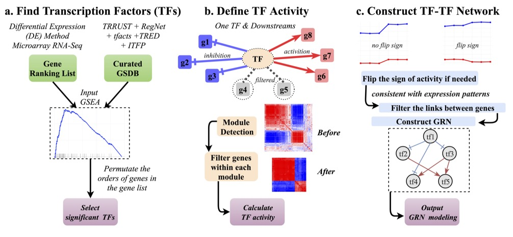

<center> <h2> NetAct: TF-gene regulation network construction </h2> </center>


NETACT is a R package designed for inferring TF networks. All the copyrights  are explained by Kenong Su kenong.su@pennmedicine.upenn.edu and [Dr. Lv's lab](https://www.lusystemsbio.com).

Inferring transcript factor activity is the key to construct transcriptional regulatory network which reveals the story of biological process. However current methods for predicting transcript factor activity are still challenging mainly because of two factors: (1) the lack of a comprehensive transcript factor targets database. (2) directly utilizing the expression levels which cannot comprehensively represent transcript factor activity levels could defect the accuracy of the activity prediction. To tackle these issues, we introduce NetAct a purely data-driven approach for constructing transcript regulatory network. We experimentally validate its ability in accurately mining perturbed factors and predicting activity behaviors. We applied NetAct to epithelial–mesenchymal transition cases to obtain the gene regulatory network which reveals the regulatory mechanism in cellular progress with mathematical modeling.

-------------------



### 1. Software Installation
```
library(devtools)
install_github("suke18/NetAct", dependencies=T, build_vignettes = T)
library(NetAct)
```

### 2. Quick Start and Tutorial
For the step-by-step instructions, please refer to this [tutorial](https://github.com/suke18/NetAct/blob/main/doc/NetAct_Tutorial.html):
